<a name="top"></a>

<div align="center">



<br />

<a href="https://github.com/Hacking-Notes/Subdomain-Takeover/stargazers"></a>
<a href="https://github.com/Hacking-Notes/Subdomain-Takeover/network/members"></a>
<a href="https://github.com/Hacking-Notes/Subdomain-Takeover/commits"></a>
<a href="LICENSE"></a>
<a href="https://hacking-notes.com"></a>

</div>

<br />

## Overview  
**Subdomain Takeover** is an automated tool for discovering subdomains and checking for potential takeover vulnerabilities. It supports both passive (crt.sh) and active (brute-force) subdomain enumeration, and it identifies misconfigured subdomains that may be vulnerable to takeovers.  


## Features  
- **Subdomain Enumeration**:  
  - Uses `crt.sh` for passive subdomain discovery.  
  - Performs brute-force enumeration using customizable wordlists.  
- **Subdomain Takeover Detection**:  
  - Checks CNAME records for abandoned services.  
  - Detects subdomains pointing to services like AWS, Heroku, GitHub Pages, and more.  
- **Multi-threading**: Faster scanning with concurrent requests.  
- **Customizable Wordlists**: Choose between fast, normal, and deep scanning modes.  
- **Automatic Results Saving**: Outputs discovered subdomains to a file.  


## Installation  
1. Clone the repository:  
   ```bash
   git clone https://github.com/Hacking-Notes/Subdomain-Takeover.git
   cd Subdomain-Takeover
   ```  
2. Install dependencies:  
   ```bash
   pip install -r requirements.txt
   ```  


## Usage  
1. Place a list of target domains inside a `targets.txt` file. The first domain in the file will be used.  
2. Run the script:  
   ```bash
   python 606-sub-takeover.py
   ```  
3. Choose a search method:  
   - `1`: Use `crt.sh` for passive discovery.  
   - `2`: Use brute-force subdomain scanning.  
   - `3`: Use both methods.  
4. If using brute-force, select a wordlist:  
   - **Fast** (~1,000 subdomains)  
   - **Normal** (~10,000 subdomains) *(Default)*  
   - **Deep** (~100,000 subdomains)  
5. Optionally, run the subdomain takeover test.  


## Example Output  
```
Extracted base domain: example.com
Choose a search method:
1. crt.sh
2. Brute force
3. Both

Running crt.sh search...
- Found subdomains:
  www.example.com
  api.example.com
  dev.example.com

Starting brute force scan...
[300/10000] (3%) -> admin.example.com [403 Forbidden]
[1500/10000] (15%) -> shop.example.com [200 OK]

Testing for potential subdomain takeover...
- Subdomain api.example.com points to a non-existing Heroku app!
```


## Supported Takeover Detection  
The tool checks subdomains for CNAME misconfigurations leading to takeovers, including:  
- **Heroku**: "There is no app configured at that hostname."  
- **AWS S3**: "NoSuchBucket" error detected.  
- **GitHub Pages**: "There isn't a GitHub Pages site here."  
- **Shopify**: "Sorry, this shop is currently unavailable."  
- **Squarespace, Tumblr, WPEngine**, and more.  


## Output  
- Results are saved in the `outputs/` directory as:  
  ```
  outputs/subdomain-example.com.txt
  ```


## License  
This project is licensed under the MIT License.  


## Disclaimer  
This tool is intended for **legal security testing and research purposes only**. Do not use it on systems you do not own or have explicit permission to test.  

---


## 🧰 Hacking Notes Ecosystem

<div align="center">

🌐 &nbsp;**[hacking-notes.com](https://hacking-notes.com)** &nbsp;·&nbsp; ✍️ &nbsp;**[blog](https://hacking-notes.medium.com/)** &nbsp;·&nbsp; 💬 &nbsp;**[discord](https://discord.gg/r68ameNHrD)**

</div>

| | Resource | What you get |
| :-: | -------- | ------------ |
| 🗺 | **[Hacker-Roadmap](https://github.com/Hacking-Notes/Hacker-Roadmap)** | Structured paths from beginner to pro — hobbyist, bug bounty, certs & degree. |
| 🔴 | **[RedTeam Notes](https://github.com/Hacking-Notes/RedTeam)** | Offensive security notes: recon, exploitation, Windows & Linux. |
| 🔷 | **[BlueTeam Notes](https://github.com/Hacking-Notes/BlueTeam)** | Defensive security notes: forensics, malware, log & packet analysis. |
| 🧩 | **[Extensions](https://github.com/Hacking-Notes/Extensions)** | Curated Chrome extensions for ethical hacking & recon. |
| 🔖 | **[Bookmarks](https://github.com/Hacking-Notes/Bookmarks)** | Curated hacker bookmark collection, one import away. |


<div align="right"><a href="#top">⬆ back to top</a></div>
